# 🏘️ Dashboard of Socio-Economic Conditions in Pandean Village

<div align="center">
  
  
  
  ### *A dashboard that depicts the community’s socioeconomic conditions.*
  
[](https://laravel.com/)
[](https://www.php.net/)
[](https://www.mysql.com/)
[](https://vitejs.dev/)
  
</div>

---

## ✨ Overview

> **Kuliah Kerja Nyata (KKN) project** commissioned by the Village Secretary. Built with Laravel and a MySQL database. Data was sourced from the village’s existing records and interviews with local officials. I served as the full-stack developer, handling database schema design, REST APIs/back end, and front-end UI.

### 🎯 Key Features

- 🏡 **Real-Time Socioeconomic Insights** - Live view of Pandean Village community indicators
- ✍️ **Streamlined Data Entry** - Easy, accurate forms for adding and updating records
- 👥 **Role-Based Authentication** - Access tailored to village officials’ responsibilities
- 📱 **Modern, Responsive Design** - Seamless experience on mobile, tablet, and desktop

---

## 👥 User Roles & Permissions

<div align="center">

| 🎓 Role | 📝 Description | 🔑 Key Features |
|---------|----------------|------------------|
| **Village Head** | Top-level administrator overseeing all hamlets | View dashboards for all hamlets; view, edit, and delete data across the entire village |
| **Village Secretary** | Administrative manager assisting the Village Head | View dashboards for all hamlets; view, edit, and delete data across the entire village |
| **Hamlet Head (×7)** | Leader of a specific hamlet | View their hamlet’s dashboard; view, edit, and delete their hamlet’s data; separate dashboards and data-entry forms per hamlet |

</div>

---

## 🛠️ Technology Stack

<div align="center">

### Backend


### Frontend


</div>

---

## 📸 Application Screenshots

> **Using Dummy Data (NOT related to the original village data)**.

<details>
<summary>🖼️ <strong>Click to view application interface</strong></summary>

<br>

<div align="center">

### 🔐 Authentication
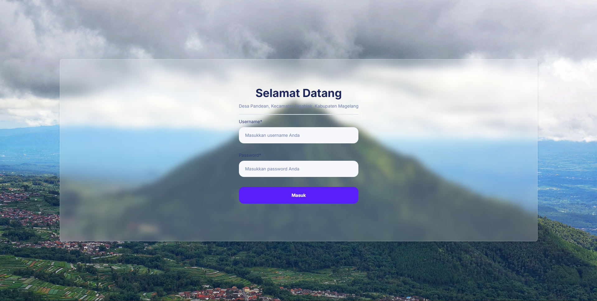

### 📊 Village Head and Village Secretary - Dashboard

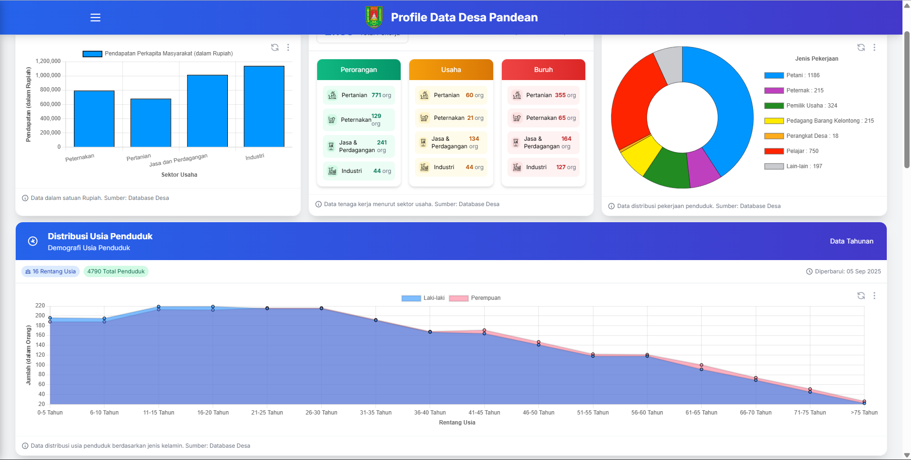
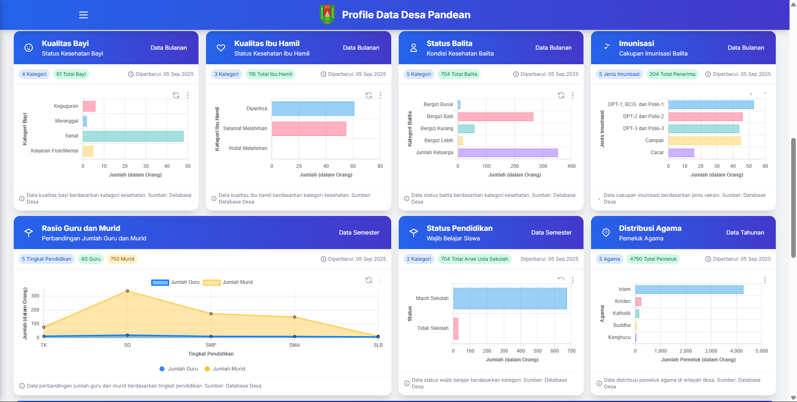
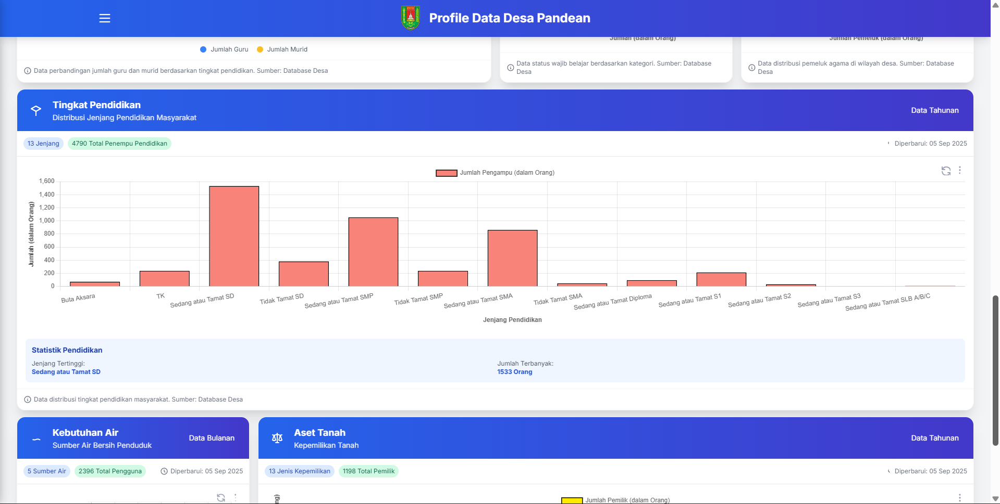
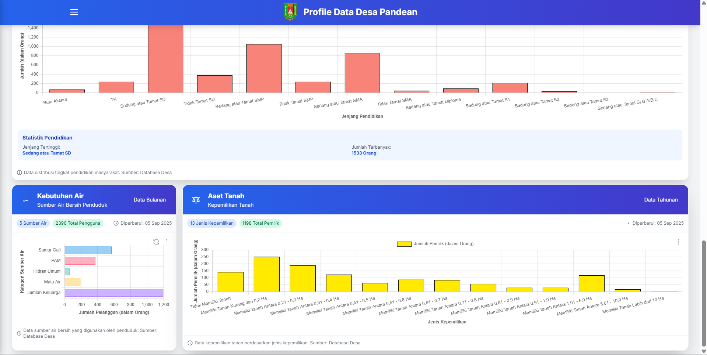
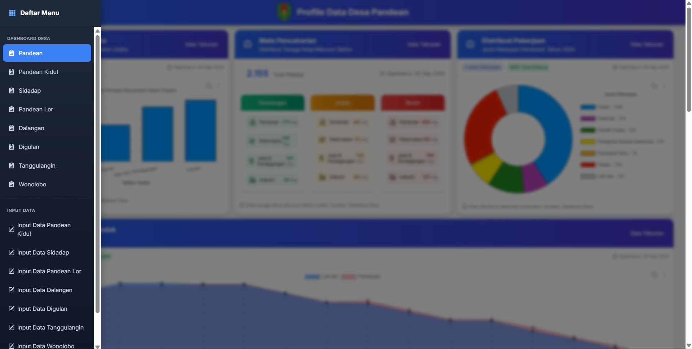

### 📈 Hamlet Head - Dashboard
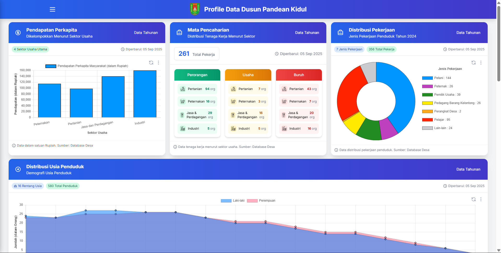
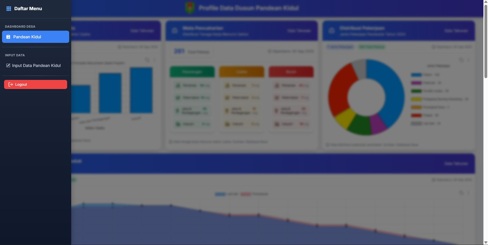
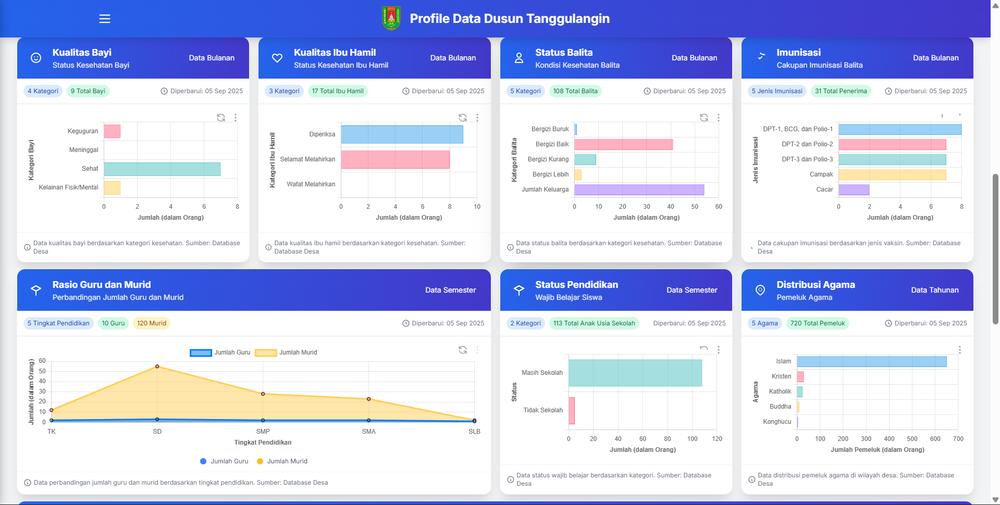
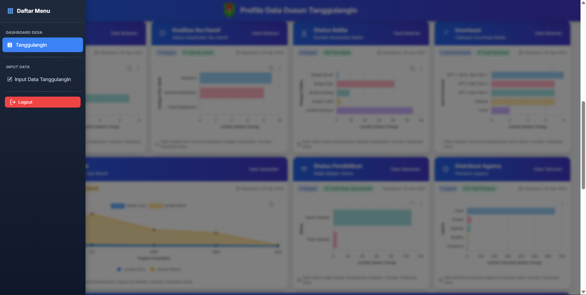

### ✍️ Input Data
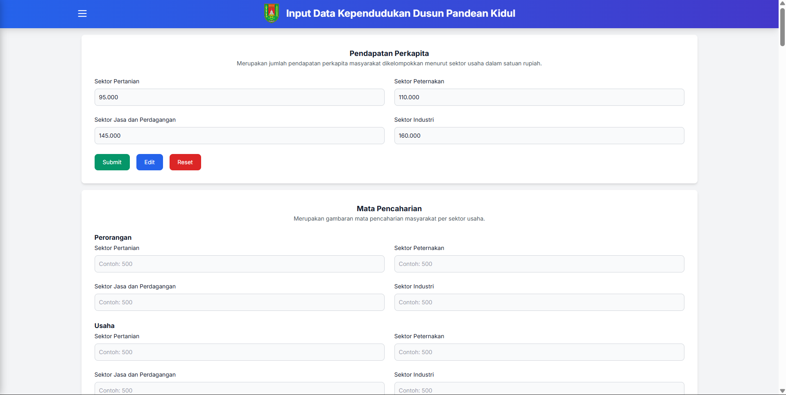
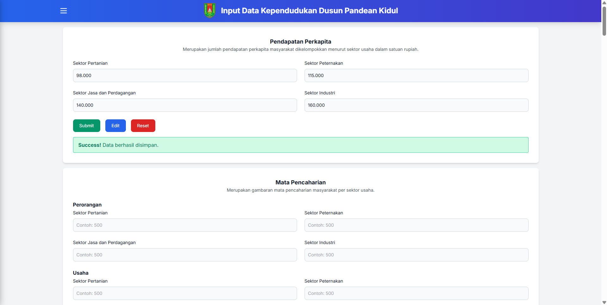


</div>

</details>

---

## 🚀 Quick Start Guide

### Prerequisites
- 🐘 **PHP 8.1+**
- 🎵 **Composer**
- 🗄️ **MySQL 8.0+**
- 📦 **Node.js & NPM**

### Installation

```bash
# 📥 Clone the repository
git clone https://github.com/bonifasiusbryan1/Dashboard-Desa-Pandean.git
cd Dashboard-Desa-Pandean

# 📦 Install dependencies
composer install && npm install

# ⚙️ Environment setup
cp .env.example .env
# Configure your database settings in .env

# 🗄️ Database setup
mysql -u root -p -e "CREATE DATABASE your_database_name;"
php artisan migrate

# 🔑 Generate application key
php artisan key:generate

# 🔗 Create storage symlink
php artisan storage:link

# 🚀 Launch the application
npm run dev
php artisan serve
```

### 🌐 Access the Application
Open your browser and navigate to: `http://127.0.0.1:8000`

---

## 📂 Project Structure

```
Simple-Student-Monitoring-System/
├── 📁 app/                 # Application core files
├── 📁 database/            # Database migrations & seeds
├── 📁 public/              # Public assets & screenshots
├── 📁 resources/           # Views, CSS, JS resources
├── 📁 routes/              # Application routes
```

</div>
